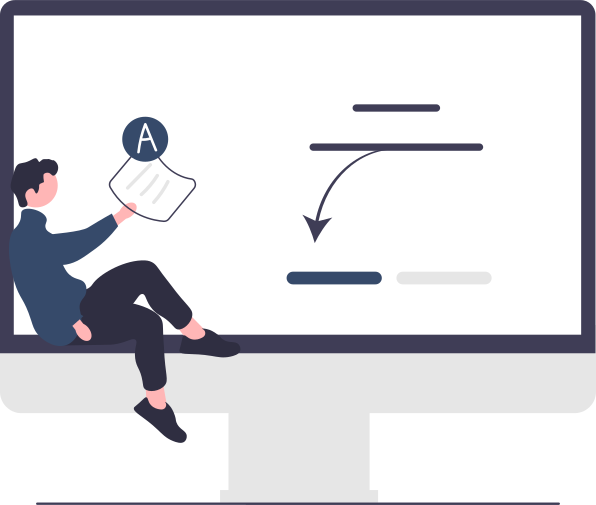

# Programmation

* Python
* C
* C++
* C#
* .NET
* Java
* JavaFX
* Kotlin
* Applications mobiles
* MVC
* Design Pattern
* Assembleur

Au cours de mon parcours universitaire, j'ai eu l'opportunité d'acquérir des compétences dans une grande diversité de langages de programmation et de concepts associés. Dès ma première année à l'IUT, j'ai débuté par l'apprentissage des fondamentaux de la programmation en Java, me permettant ainsi de me familiariser avec la Programmation Orientée Objet, la conception d'algorithmes, ainsi que le développement d'applications suivant le modèle MVC, notamment avec JavaFX.

Fort de ces bases, ma deuxième année a été consacrée au développement de compétences avancées à travers l'apprentissage du langage C, suivi du C++. Cette étape m'a permis de découvrir les design patterns, tels que le singleton ou le composite. La maîtrise de langages de bas niveau tels que le C et l'assembleur a également enrichi ma compréhension générale du fonctionnement des langages de programmation.

Cette période a également été marquée par l'exploration du développement d'applications mobiles, en utilisant Android Studio. Si le cadre de nos cours à l'IUT nous a amenés à développer en Java, j'ai choisi d'approfondir mes connaissances en apprenant le langage Kotlin en parallèle, élargissant ainsi mon champ de compétences.

En octobre 2023, lors d'une game jam, j'ai eu l'opportunité de collaborer en équipe au développement d'un jeu en Python, en utilisant Pygame. Grâce à mes bases préexistantes en Python, j'ai pu rapidement m'adapter à cette nouvelle plateforme de développement.

# Developpement WEB

* HTML
* CSS
* JavaScript
* JQuery
* PHP
* Node.js
* React.js
* Angular
* Symfony
* Bootstrap

Ma première année à l’IUT a marqué mes débuts dans le développement web avec HTML et CSS. Grâce à mes bases préexistantes en HTML, j'ai rapidement su m'adapter et exploiter efficacement CSS pour créer des designs, profitant de la liberté qu'offre ce langage. Dans le but d'améliorer mes sites et d'ajouter de l'interactivité, j'ai également entrepris d'apprendre JavaScript de manière autodidacte.

Au cours de ma deuxième année, j'ai eu l'opportunité de suivre des cours de JavaScript qui ont renforcé mes compétences dans ce langage. De plus, j'ai acquis des connaissances en PHP. Pendant la semaine internationale, un professeur d'une université irlandaise m'a initié aux bases de jQuery.

Le premier projet universitaire de l'année nous a offert une liberté technique. Sur les conseils d'un développeur que je connaissais, nous avons choisi de développer notre application en utilisant React.js. J'ai rapidement assimilé son fonctionnement et me suis adapté à cette nouvelle technologie.

Par la suite, j'ai également maîtrisé Symfony, un framework que nous avons employé pour notre deuxième projet universitaire.

Enfin, lors de mon stage de fin de deuxième année, j'ai acquis des notions de base en Angular.

# Gestion de bases de données

* PostgreSQL
* SQLite
* SQL server (MSSQL)
* Oracle

Mon initiation à ce domaine a débuté par l'apprentissage des requêtes SQL. Cela m'a permis de me familiariser avec des requêtes simples ainsi que des requêtes plus complexes, incluant des sous-requêtes, entre autres.

Après l'acquisition de ces bases, j'ai approfondi ma compréhension du fonctionnement des outils de gestion de bases de données, en mettant l'accent sur PostgreSQL. J'ai ainsi maîtrisé l'installation et l'administration de cet outil, ainsi que l'utilisation du système de transaction et l'optimisation des requêtes.

Lors de mon stage de fin de deuxième année, j'ai eu l'opportunité de travailler avec SQL Server. J'ai alors conçu une base de données conteneurisée dédiée aux tests d'intégration de l'API de mon entreprise.

Plus généralement, dans le domaine des bases de données, j'ai perfectionné mes compétences en optimisant des modèles et en élaborant des schémas relationnels bien structurés, en suivant les principes de normalisation et en explorant la modélisation multi-dimensionnelle.

# Déploiement d'application, cloud, administration de systèmes et réseaux

* Apache
* Serveurs Linux
* Docker
* Conteneurisation

J'ai rapidement acquis les compétences pour installer Linux, notamment en ligne de commande, et configurer tous les logiciels nécessaires au développement ou au déploiement d'un serveur simple. Cela comprend Apache, PostgreSQL, PHP, ainsi que la configuration du système et du réseau.

Par la suite, j'ai découvert Docker, une alternative plus simple et efficace aux machines virtuelles que j'utilisais auparavant. J'ai rapidement appris à créer et gérer plusieurs conteneurs communicants, ainsi qu'à rédiger des Dockerfiles et docker-compose permettant à d'autres développeurs de créer leurs conteneurs de manière simple et rapide.

# Réalisation de tests

* Mocha
* Cypress
* XUnit
* Moq
* AutoFixture

J'ai entamé mon apprentissage des tests JavaScript avec Mocha, ainsi que la génération de la couverture du code à l'aide d'outils tels qu'Istanbul. Par la suite, j'ai découvert l'utilisation de Cypress pour effectuer des tests fonctionnels sur des interfaces web, que j'ai rapidement maîtrisés.

Au cours de mon stage de fin de deuxième année, j'ai acquis des compétences dans la réalisation de tests pour une API en utilisant XUnit. Cela m'a permis de maîtriser les tests unitaires et d'intégration en suivant la méthode Arrange, Act, Assert. De plus, j'ai appris à mocker des parties du code pour faciliter la réalisation de certains tests unitaires.

# Compétences transversales

* Rigoureux
* Collaboratif
* Créatif
* Autonome

Mes compétences transversales principales sont la rigueur, la collaboration, la créativité et l’autonomie. Ces qualités se sont largement développées à travers mes expériences professionnelles saisonnières, caractérisées par un engagement intense malgré certaines contraintes (physiques, horaires). Avant même de suivre la formation du BUT informatique, j'ai acquis des compétences en autodidacte en apprenant à coder, notamment en suivant des cours de terminale en Numérique et Science de l’Informatique de façon indépendante.

Mon expérience à l’IUT2 de Grenoble a renforcé mon autonomie et ma rigueur, nécessitant mon départ du foyer familial pour m'installer en complète autonomie dans la ville. Les projets universitaires, ainsi que les collaborations avec d’autres étudiants tant sur le plan académique que dans des initiatives extra-universitaires telles que ma participation à l'élection BDE 2023, ont également contribué à développer mes capacités de collaboration et de gestion de projet en équipe.

Les cours et projets universitaires axés sur la création de sites web et d'applications ont particulièrement stimulé ma créativité. Concevoir des applications en réfléchissant aux fonctionnalités, à l’interface et au design a été passionnant et a considérablement enrichi mes compétences créatives.

Mon stage de dix semaines en entreprise, validant ma deuxième année, a été une opportunité cruciale pour améliorer ma rigueur et mes compétences en collaboration. Intégré dans l’équipe de développement, j'ai découvert le fonctionnement du travail en équipe sur des projets concrets, m'adaptant rapidement et utilisant efficacement les outils de gestion d'équipe.

Enfin, le projet de réaliser ma troisième année d’études à l’étranger, au Québec, a été une expérience déterminante pour renforcer ma rigueur et mon autonomie. Que ce soit pour l’installation, l’adaptation ou la gestion des démarches administratives pour l'obtention des visas et permis de séjour, cette expérience m'a permis de développer des compétences essentielles dans un contexte international.

# Langues parlées

* Anglais
* Italien

Au lycée, j'ai choisi de suivre en première et en terminale la spécialité LLCE (Langue, Littérature et Culture Étrangère) en anglais. Cette spécialité a grandement contribué à l'amélioration de mon niveau en anglais, me permettant d'atteindre le niveau C1 à l'oral comme à l'écrit.

Par ailleurs, divers voyages à l'étranger, notamment en Angleterre et aux États-Unis, ont également été des occasions importantes pour renforcer mes compétences linguistiques en anglais.

En plus de cela, j'ai sélectionné l'italien en tant que LV2, ce qui m'a permis d'acquérir les bases de cette langue et d'atteindre un niveau B1.