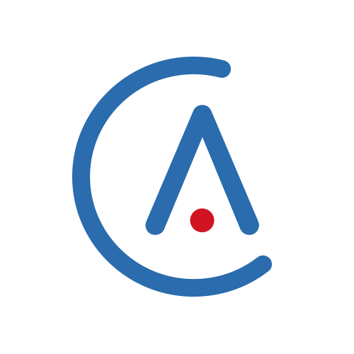
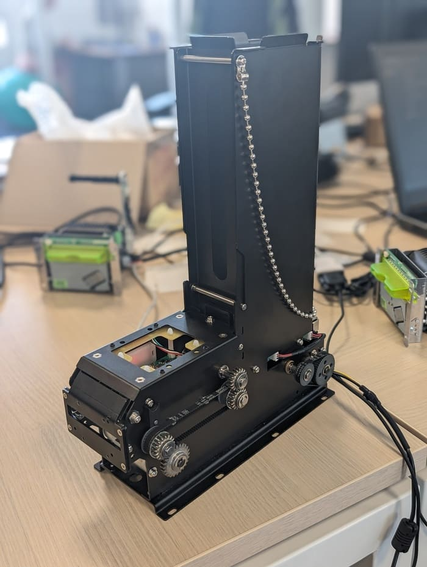
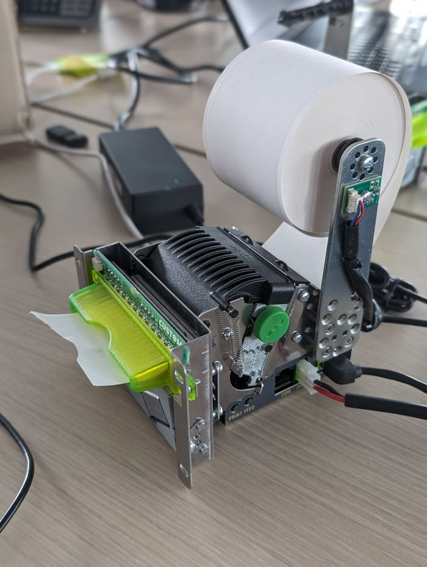

# Stage de fin d’année de BUT2

* C#
* .NET
* Cypress
* Angular
* Sérialisation et désérialisation de données hexadécimal
* Tests
* Tests unitaires
* Tests d'intégration
* Tests fonctonnels
* Travail en équipe
* Experience professionelle

*Il s'agit de mon stage de fin de deuxième année de BUT. Passé dans l'entreprise Alpilink, il vise a mettre en application dans un contexte professionel les compétences acquises durant les deux dernières années de formations*

Ce stage s’est déroulé dans l’entreprise Alpilink, une société présentant divers services aux stations de ski. Celle-ci propose la mise en place de bornes, permettant l’achat et le retrait de forfait de ski via un écran tactile, ainsi que des services pour la vente en ligne de forfaits. Afin de correctement gérer les ventes, un back-office permet aux stations d’effectuer un grand nombre d’actions sur la base de données, ayant un effet direct sur les bornes et les ventes en ligne. L’environnement technique est principalement axé sur les outils fournis et développés par Microsoft, comme Azure Devops ou Visual Studio. Le principal langage est le C# avec framework .NET tandis que SQL server et postgresql sont utilisés pour les bases de données. L’entreprise utilise aussi Angular pour les applications front-end.

Les tâches principales du stage peuvent être regroupées en deux grandes parties. La première a porté sur la réalisation de tests unitaires sur l’API de l’entreprise en C# en utilisant XUnit, et des tests fonctionnels sur la partie Front-end en Angular en utilisant Cypress. La seconde partie du stage a consisté en la conception et réalisation d’un projet permettant de facilement communiquer avec les imprimantes et dépileurs, impliquant de sérialiser et désérialiser des données. L’objectif est de proposer l’architecture la plus optimisée possible. A terme, ce projet sera incorporé dans le projet plus global de refonte des bornes, car l’ancienne application est vieillissante et de moins en moins maintenable.

La réalisation de tests unitaires a commencé par de la programmation en binôme afin de s’approprier le code de l’entreprise ainsi que la manière de réaliser les tests. Celle-ci repose principalement sur la structure “Arrange, Act, Assert”. Celle-ci consiste à, dans un premier temps, définir les données qui seront utilisées lors du test (Arrange). Ensuite, agir sur le composant à tester (Act). Enfin, vérifier si le résultat obtenu correspond aux attentes (Assert). La méthode du “mock” est aussi utilisée, consistant en la simulation de différentes parties du code dont dépend le composant à tester. Après avoir avancé sur les tests des services et des contrôleurs, il a fallu tester les dépôts. Ceux-ci nécessitent de réaliser une base de données dédiée et identique à celle de production. Pour cela, l’utilisation de docker, permettant de facilement créer et gérer cette base de données a été nécessaire. Il a également fallu programmer des scripts permettant de facilement gérer cette base de données, comme ajouter des tables, des vues ou des procédures stockées, ainsi que de pouvoir les supprimer automatiquement. Ainsi, un grand nombre de tests sur les dépôts ont pu être écrits, menant à une couverture finale du code de 65%. Avec au total plus de 1200 tests, près de 90 bugs ont été découverts sur l’API.

La réalisation du projet permettant de facilement communiquer avec différents appareils a nécessité une phase de conception conséquente afin de réaliser une architecture optimisée et répondant aux besoins de l’entreprise. Tandis que la première version de cette architecture ne permettait de prendre en compte seulement les imprimantes, diverses évolutions et mises à jour ont permis de généraliser le projet à divers autres composants. Celui-ci a nécessité l’utilisation et la manipulation de ports de communication en série afin d’écrire les données à envoyer et de lire celles reçues. La communication reposant sur l’envoi d’octets (une série de huit bits, soit huit zéros ou uns), il a fallu correctement gérer la sérialisation et désérialisation des données et des instructions. A l’issue du développement, ce projet permet d’envoyer une commande, de recevoir une réponse et de la traiter de manière explicite et concise, permettant de traiter un grand nombre de cas d’erreurs jusqu'alors ignorés sur le précédent projet.

depileur

imprimante

Ce stage a impliqué beaucoup de travail en équipe, que ce soit en utilisant divers outils mis à ma disposition, ou en mettant en application mes compétences acquises en méthodes agiles, car celles-ci sont appliquées dans l’entreprise.

