# Musculator
* Projet personnel
* Next.js
* typescript
* tailwindcss
* Déploiement d'application

Le but de ce projet est de créer un site web permettant de naviguer parmi une large banque d'exercices de musculation, d'en sélectionner, d'en ajouter ou encore de créer des séances d'entrainement.

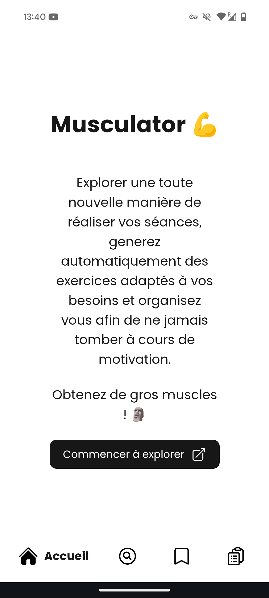

Page d'accueil du site

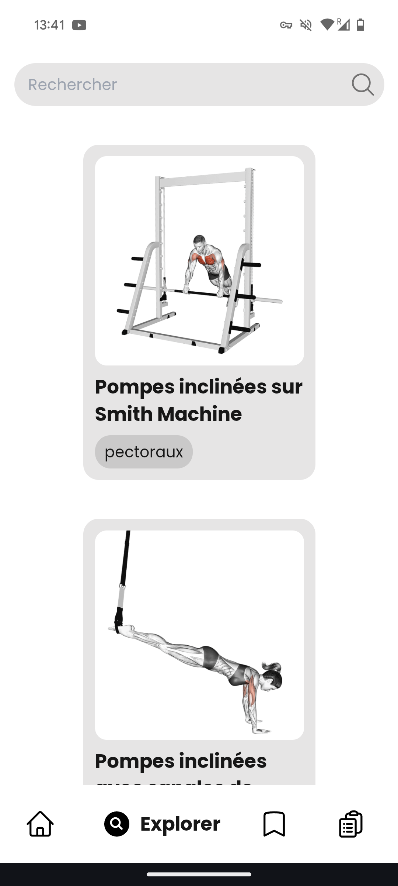

Recherche d'exercices

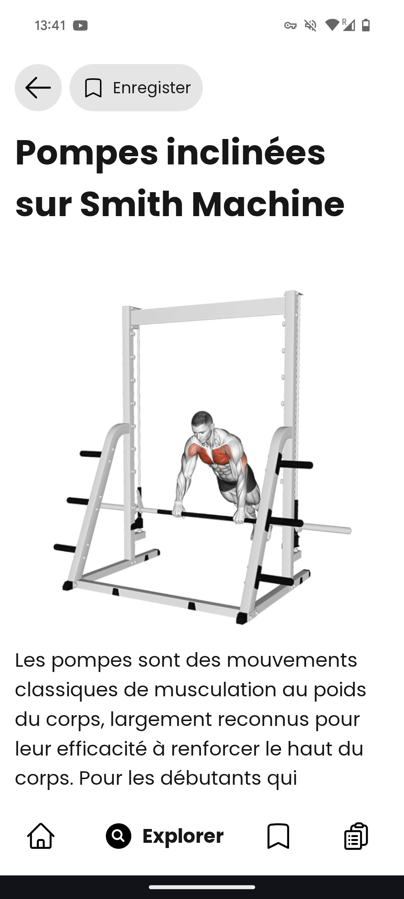

Page montrant les details d'un exercice

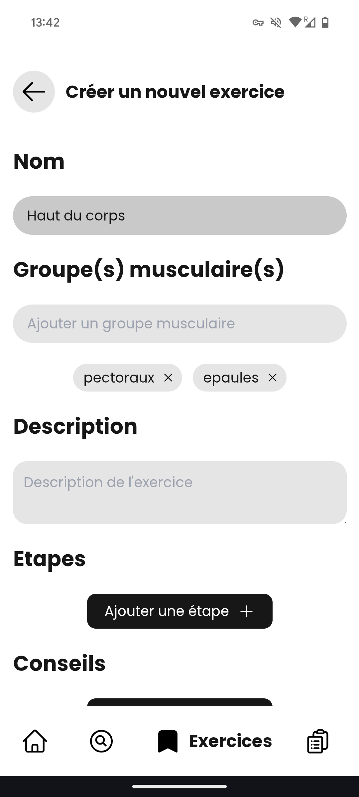

Page de création d'un exercice

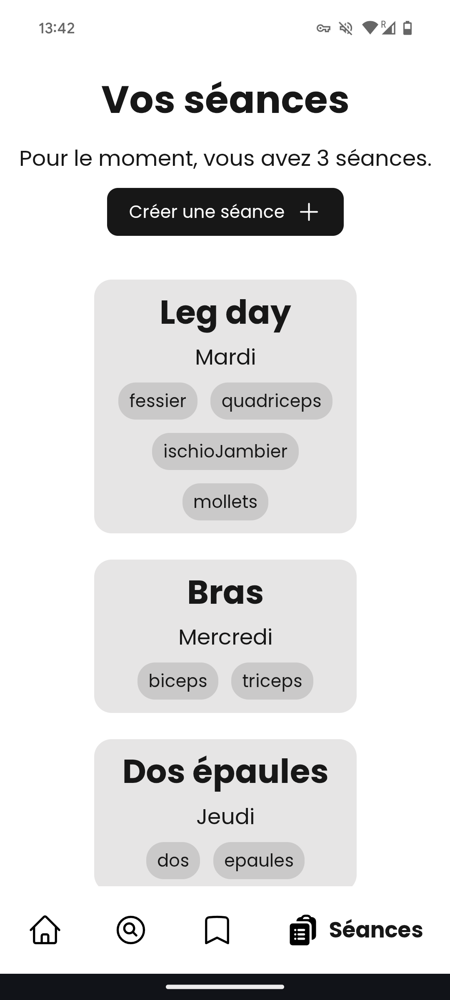

Liste des séances créées par l'utilisateur

Le site dispose d'une banque de près de 500 exercices différents. Lorsque l'utilisateur souhaite créer une séance, les exercices les plus pertinents lui sont proposés selon les groupes musculaires sélectionnés.

L'interface utilisateur a été pensée pour l'affichage sur mobile, et le site web est installable sous forme d'application native grâce à la technologie PWA (progressive web app).

# Alabasta
* Projet personnel
* Next.js
* Déploiement d'application
* Création et gestion d'une base de données
* PostgreSQL
* Sécurisation des échanges avec le serveur
* Réalisation d'une API

Ce projet personnel a pour objectif de créer un site web dynamique permettant de rechercher facilement des informations sur des films, de se constituer une liste de lecture et d'échanger des recommandations avec d'autres utilisateurs.

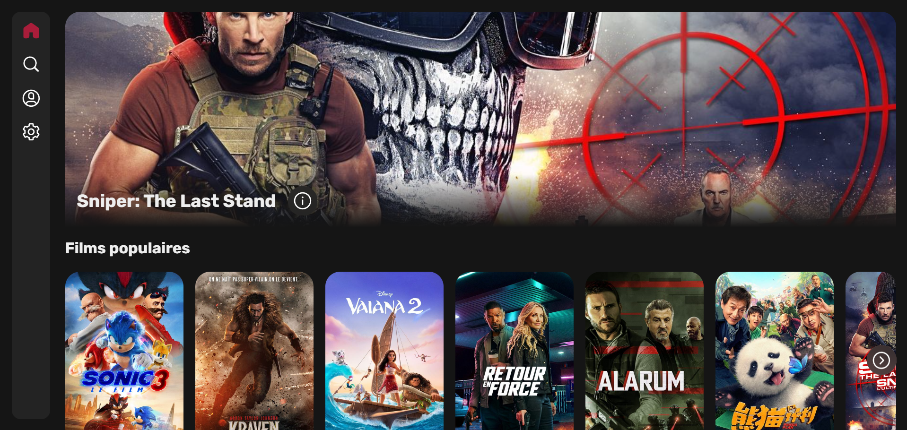

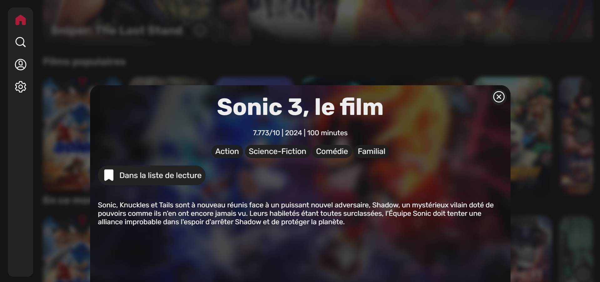

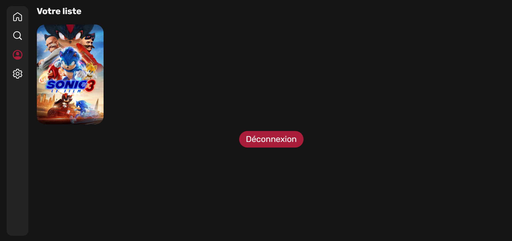

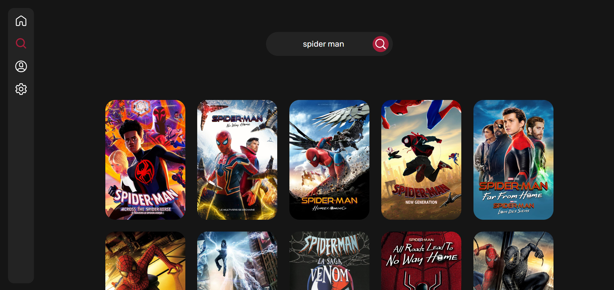

Ce projet a été réalisé avec le framework Next.js, à partir duquel j'ai déployé une application web complexe au format MVC ainsi qu'une API permettant de récupérer et de trier les données provenant de plusieurs API dédiées aux films et à la base de données.

Le site est déployé sur Vercel, et la base de données PostgreSQL est intégrée au service. Les échanges sont entièrement sécurisés, garantissant la confidentialité des informations des utilisateurs. La connexion au compte utilisateur est également totalement sécurisée.

# Maison à Die
* HTML
* CSS
* Next.js
* Déploiement d'applications
* Publication d'un site

Ce projet personnel vise à répondre à la demande initiale concernant une maison en location sur la plateforme Airbnb, dont le livret d'accueil n'est plus à jour et est encore au format papier. L'objectif est de créer une page web dynamique et responsive, accessible aux locataires après un simple scan d'un QR code. Ainsi, les informations deviennent plus facilement accessibles, mieux organisées et mises à jour avec davantage de simplicité.

<a href="https://maison-a-die.vercel.app/">Voir le projet</a>

La page web à étée développée avec Framework Next.js, et déployée à partir de Vercel.

# Ce portfolio
* HTML
* CSS
* JavaScript
* Developpement WEB
* Plublication d'un site
* Indexation d'un sit sur les moteurs de recherche

Ce projet consiste en la réalisation de ce portfolio depuis zéro. Véritable vitrine de mes compétences, j'y ai apporté une attention particulière. Afin de limiter les coûts de déploiement sur mon hébergeur, j'ai choisi de le développer uniquement en HTML, CSS et JavaScript, sans utiliser de framework, de plugins ni de bibliothèque.

Malgré ces contraintes techniques, je souhaitais avoir un site fluide et dynamique, où l'ajout de contenu est simplifié au maximum. En plus de porter une grande attention à la réalisation du CSS, le développement des divers composants JavaScript a joué un rôle crucial dans ce projet. Un fichier Creator.js permet de créer des éléments HTML à partir de "components", c'est-à-dire des morceaux de code HTML. Un fichier Designer.js permet d'ajouter ces éléments aux endroits appropriés sur les pages. Enfin, chaque page a un fichier dédié pour gérer l'ajout des éléments en fonction du contexte. Un fichier Utils.js permet d'ajouter certaines fonctionnalités globales au site. Ainsi, certains composants comme la barre de navigation, le footer, les popups, la barre de recherche ou encore les blocs de contenu dans les pages "Projets" et "Expériences" sont ajoutés dynamiquement.

Les blocs de contenu sont automatiquement créés à partir de fichiers Markdown contenant les titres, textes, liens ou images à afficher. Pour trier facilement ces éléments et les ajouter au bon endroit, il a été nécessaire de développer une fonction de parsing de Markdown. Ainsi, le simple fait d'écrire dans ces fichiers ajoute automatiquement de nouveaux éléments à la page web.

Une fois le développement terminé, j'ai déployé mon site depuis l'hébergeur infinityfree.com. Pour avoir un nom de domaine personnalisé, j'ai acquis le domaine mael-garnier.fr depuis amen.fr. Après la configuration des DNS, le site était enfin disponible sous mon domaine. Après des discussions avec des développeurs professionnels, j'ai décidé de migrer mon site vers Vercel, ce qui apporte de nombreux avantages, notamment la synchronisation automatique avec le dépôt GitHub.

# Stage Rapido 
* Symfony
* Bootstrap
* PostgreSQL
* Docker
* Java
* Android
* Résolution de problème
* Travail en équipe

Ce projet, réalisé en groupe de six personnes, a marqué la fin de ma deuxième année de BUT (2023/24). Il consistait initialement à prendre en main un back office Symfony, une base de données PostgreSQL, ainsi qu'une application mobile permettant aux étudiants du BUT de trouver facilement un stage, et aux administrateurs et entreprises d'ajouter et de gérer facilement de nouvelles offres. Ces applications présentaient de nombreuses erreurs, qu'elles soient fonctionnelles, liées à la sécurité, visuelles, ou d'ergonomie, entre autres. Nous avons donc dû procéder à une analyse approfondie afin d'identifier les problèmes et les erreurs existants, de déterminer leur ordre de priorité et la manière de les résoudre. Nous avons suivi plusieurs phases de gestion de projet pour cela.

Back-office web
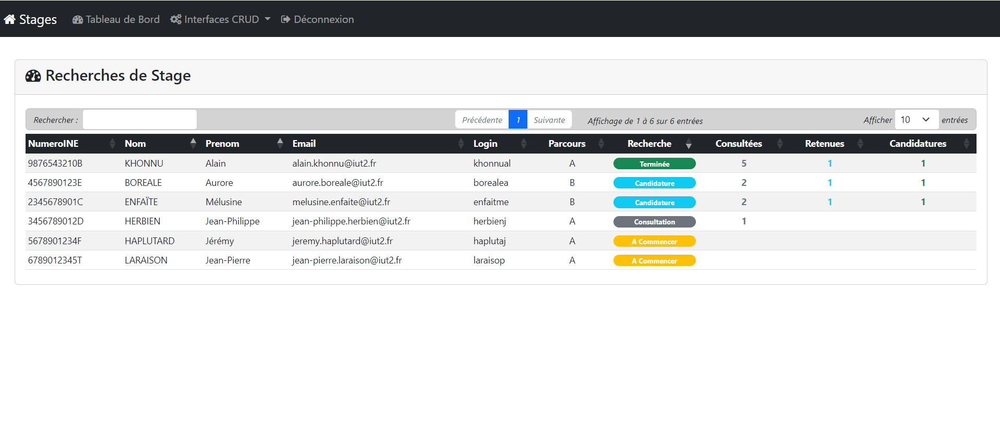

Application mobile
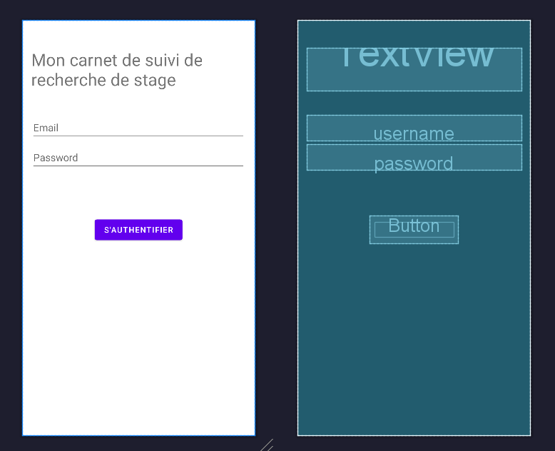

Ensuite, nous avons réparti les tâches à accomplir entre les différents membres du groupe, puis avons corrigé autant de problèmes que possible dans le temps imparti. Ce projet universitaire s'est conclu par une soutenance devant un jury, au cours de laquelle nous avons pu présenter notre manière de travailler ainsi que nos réalisations.

Problèmes résolus
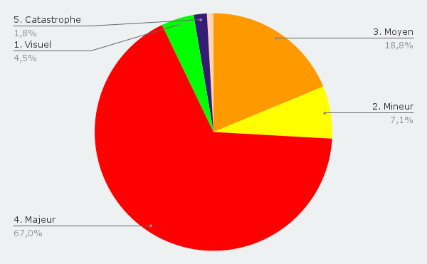

# Hello World!

* React.js
* Node.js
* JavaScript
* HTML
* CSS
* SQLite
* Travail en équipe

Ce projet, mené par un groupe de six personnes, avait pour objectif de créer une application web et une API permettant aux élèves de collège ou de lycée de s'entraîner dans une matière spécifique. Nous avions la liberté de choisir le niveau, le sujet et le langage de développement de notre application. Ayant reçu la recommandation de travailler avec React.js par un développeur que je connaissais, j'ai convaincu l'équipe d'opter pour ce framework, malgré notre manque d'expérience à son égard.

<a href="https://helloworld.mael-garnier.fr">Voir le projet</a>

Nous avons rapidement su nous adapter, en passant par toutes les étapes de la gestion de projet et de spécification en équipe avant de commencer le développement. Dans les délais impartis, nous avons pu livrer une application fonctionnelle ciblant les élèves de terminale en classe de NSI. En plus de proposer une gestion sécurisée des comptes administrateurs et élèves, avec des fonctionnalités supplémentaires pour les administrateurs, nous avons réussi à intégrer plusieurs mini-jeux éducatifs.

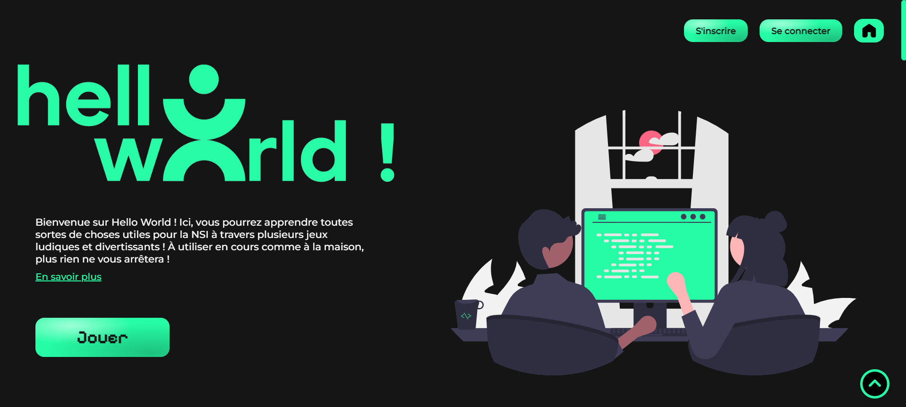

Le premier, "Squisine Lite", permet à l'élève d'assembler visuellement des blocs pour réaliser des recettes de cuisine, dans le but de préparer un plat. Il peut jouer en solo ou en multijoueur tour par tour en coopération. 

Le deuxième jeu, "Réso’f Kingdom", permet au joueur de placer divers appareils tels que des ordinateurs, des routeurs, des switchs ou des serveurs sur une carte générée aléatoirement. Le but est de positionner stratégiquement les appareils et de configurer leurs adresses IP pour les relier et récolter un maximum de ressources.

Un autre jeu consiste à assembler des blocs de programmation en renseignant leurs paramètres, afin de dessiner des formes géométriques. Ce jeu permet aux joueurs de se familiariser avec les premiers concepts algorithmiques. 

Enfin, un dernier jeu propose une enquête à mener à l'aide de commandes bash. Le joueur doit utiliser certaines commandes pour se déplacer dans différentes pièces et explorer les environs afin de résoudre le mystère.

Ce projet a été une expérience enrichissante où j'ai pu consolider mes compétences en leadership en tant que chef de projet. Nous avons réussi à relever les défis techniques et à collaborer efficacement en équipe pour aboutir à un produit final réussi.

# Eveil à l'IUT2

* Python
* Pygame
* Jeu vidéo
* GameJam
* Travail en équipe

Ce premier projet de l'année scolaire 2023/24 consistait à créer un jeu vidéo en utilisant le langage de programmation Python, avec une équipe de quatre personnes. Nous avions des contraintes à respecter, notamment sur le thème du jeu ("le monde merveilleux de l'IUT2"), le gameplay ("garder le rythme"), et sur le code (capacité à exécuter le code Python avec des paramètres).

En plus d'apprendre un nouveau langage de programmation pendant le projet, la principale difficulté résidait dans le temps imparti : seulement quatre jours pour réaliser notre jeu. Ainsi, le projet ne se résumait pas uniquement au codage du jeu, mais surtout à l'organisation de l'équipe et du travail, afin d'optimiser le temps de développement.

Ce projet m'a permis d'acquérir rapidement de nouvelles compétences en développement, notamment en apprenant un nouveau langage de programmation. En tant que chef de groupe, j'ai également appris à organiser le travail et à répartir les tâches efficacement pour atteindre les objectifs fixés.

À la fin du projet, un concours a été organisé : chaque groupe a été réparti dans l'une des six poules, chacune comprenant cinq groupes. Un jury a sélectionné un groupe parmi les cinq de chaque poule pour la finale. Notre groupe a été finaliste et a terminé à la quatrième place.

# Step By Step

* Java
* JavaFX
* Gestionnaire d'événements
* Travail en équipe

Ce projet représentait l'aboutissement de ma première année en BUT. L'objectif était de concevoir et de réaliser une application de bureau lourde en Java et JavaFX pour la gestion des événements de course à pied.

Travaillant en équipe de cinq personnes, notre démarche a débuté par des étapes cruciales de gestion de projet, notamment la définition des besoins et des contraintes, l'identification et la qualification des cibles, l'établissement de personas, ainsi que l'évaluation des risques.

Une fois ces étapes achevées, nous avons entamé la partie plus concrète du projet : la création du wireframe sur Whimsical, suivi de l'élaboration d'un dossier de conception à l'aide d'outils tels que Visual Paradigm. Ces étapes, le wireframe et le dossier de conception, ont été essentielles pour nous orienter et nous organiser efficacement lors du développement.

Nous avons ensuite entamé le développement de l'application en utilisant Java, un langage que nous maîtrisons bien et qui s'est avéré être parfaitement adapté pour une approche orientée objet. L'utilisation de Git, un outil fondamental pour le travail collaboratif, a également été indispensable pour la gestion du code en équipe.

Le projet s'est clôturé par la présentation du produit à un jury, à travers un pitch en anglais. Cette expérience m'a permis, pour la première fois, de suivre l'intégralité du processus de développement d'une application, en mettant en pratique toutes les compétences acquises au cours de mon année en BUT.

Ce travail d'équipe m'a non seulement permis de maîtriser l'utilisation d'outils collaboratifs dédiés, mais aussi d'améliorer mes compétences en communication et de comprendre l'importance de la collaboration dans la réussite d'un projet.

# CGI

* HTML
* CSS
* Recherche d'information
* Création d'un site web

Le projet, réalisé en trinôme, avait pour objectif de créer un site web permettant à un élève de troisième à la recherche d'un stage de consulter facilement des informations vulgarisées sur une entreprise du secteur du numérique, notamment une ESN (Entreprise de Services du Numérique).

<a href="https://learnaboutcgi.mael-garnier.fr">Voir le projet</a>

Dans un premier temps, nous avons entrepris des recherches sur l'entreprise qui nous avait été attribuée (CGI dans notre cas), afin de recueillir les besoins nécessaires à la future création du site web.

Une fois cette étape achevée, nous avons élaboré le wireframe de notre site en prenant en compte les besoins précédemment établis.

Ensuite, nous sommes passés au développement en utilisant les langages HTML et CSS.

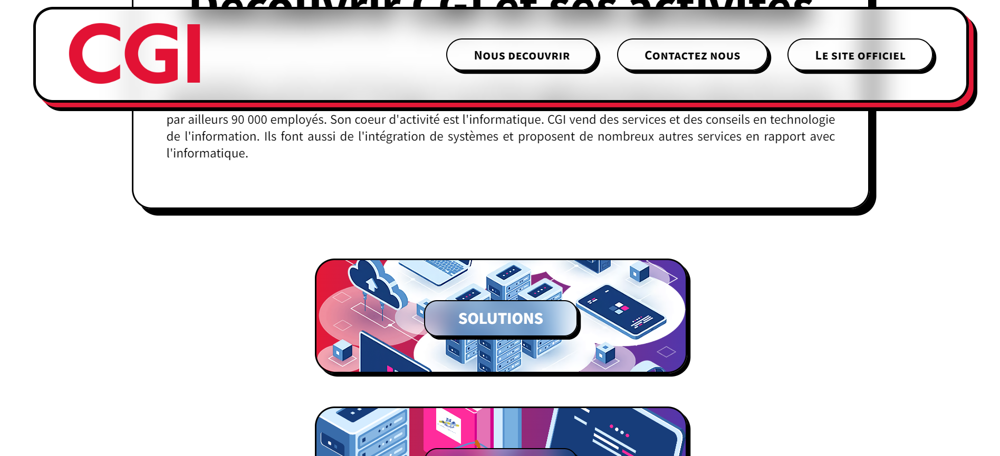

Ce projet m'a permis d'apprendre à rechercher et à partager des informations sur internet en vue d'une mise en commun avec une équipe. Une partie significative du travail a également consisté à vulgariser ces informations afin de les rendre accessibles aux élèves de troisième.

De plus, j'ai acquis une expérience pratique dans le suivi complet du développement d'un site web simple, depuis la collecte des besoins jusqu'à la présentation du produit final.

Le travail en équipe a été essentiel dans ce projet. Nous avons dû apprendre à partager efficacement notre travail et notre code, tout en les adaptant pour garantir la cohérence du produit final.

# Création d'un algorithme

* Java
* Algorithmie

Durant ce projet, j’ai acquis des compétences dans l'implémentation de besoins clients en utilisant différentes approches algorithmiques. L’objectif était de développer un algorithme capable de classifier le sujet de diverses dépêches.

Pour ce faire, il a fallu concevoir un programme en Java capable d'analyser une base de données comprenant 500 dépêches, chacune traitant l'un des cinq sujets possibles : sport, politique, environnement - sciences, culture et économie. Une fois que le programme a été entraîné sur cette base de données, il était en mesure d'analyser le texte de n'importe quelle autre dépêche et de déterminer automatiquement son sujet.

Cette SAÉ a été réalisée en binôme, ce qui nous a permis d'appliquer nos connaissances en algorithmique de manière collaborative. Nous avons également développé nos compétences en communication en apprenant à envoyer et recevoir des feedbacks de manière efficace.

Une présentation finale de notre travail nous a appris à mettre en avant les points forts de notre produit final et de notre collaboration, tout en identifiant les obstacles rencontrés lors du projet et en proposant des solutions pour les surmonter.
